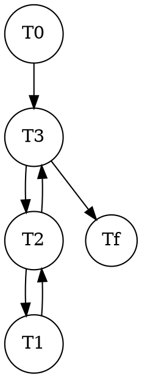
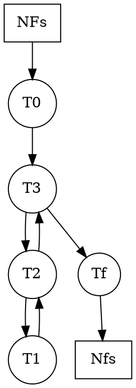
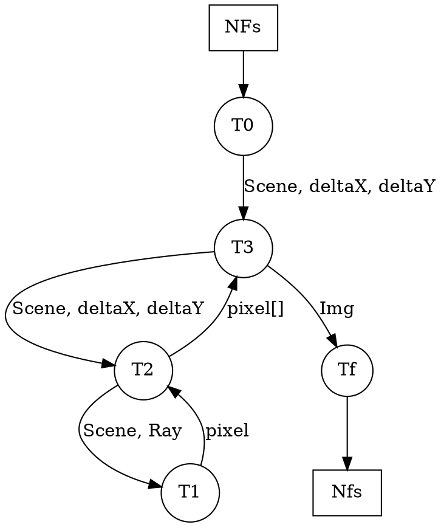
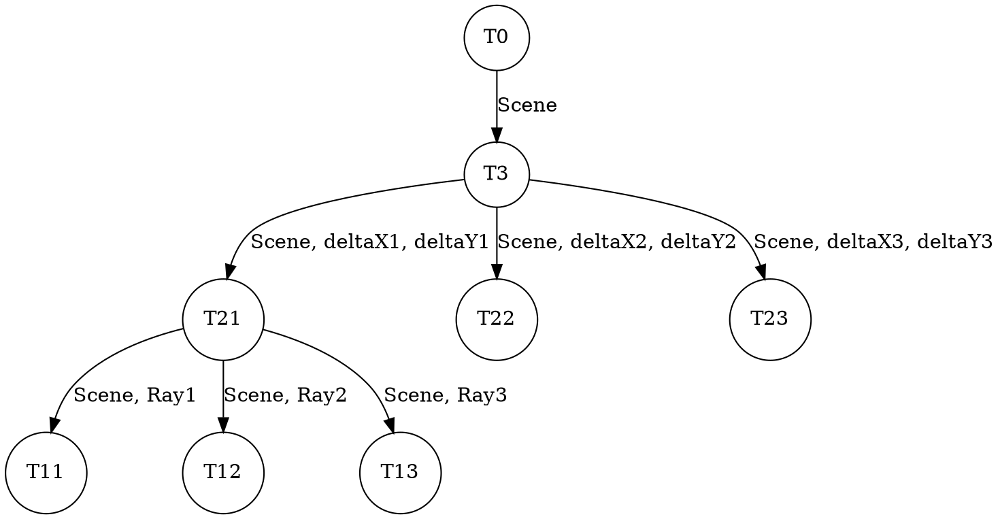
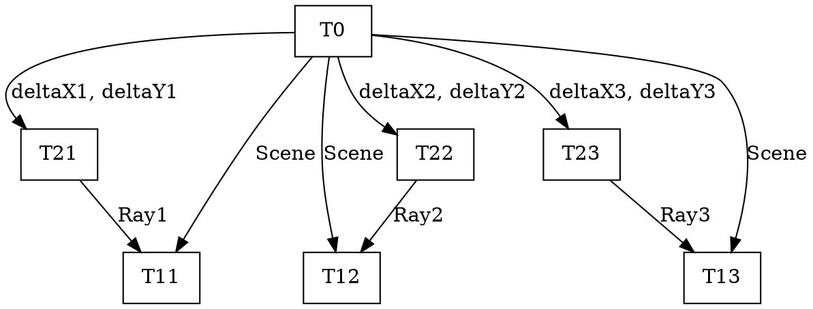

## Partición_Funcional
```
public void generateImage() {
    <T0>
    |    Ray ray; Colour color;                   
    |    double deltaX = 2d / width;
    |    double deltaY = 2d / height;
    </T0>
        <T3>
        | for(int j = 0; j < width; j++) {
        |     <T2>
        |     | for(int i = 0; i < height; i++) {
        |     |        Point p1 = new Point(-1 + i * deltaX, 1 - j * deltaY, -2d);
        |     |        Point p0 = new Point(0, 0, 0);
        |     |        ray = new Ray(p0, p1);
        |     |   <T1>
        |     |   |    color = Scene.intersectRay(ray); 
        |     |   </T1>
        |     |        image[i][j] = color;
        |     |  }
        |     </T2>
        | }
        </T3>
    }
```

## Partición_Funcional


---
## Partición_Data



---
## Comunicación


---
## Aglomeración


---
## M(apeo)


