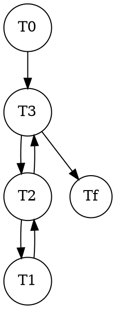
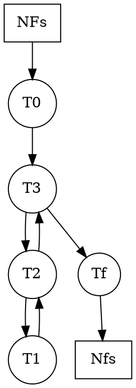
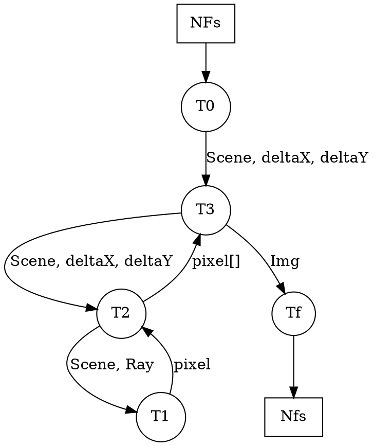
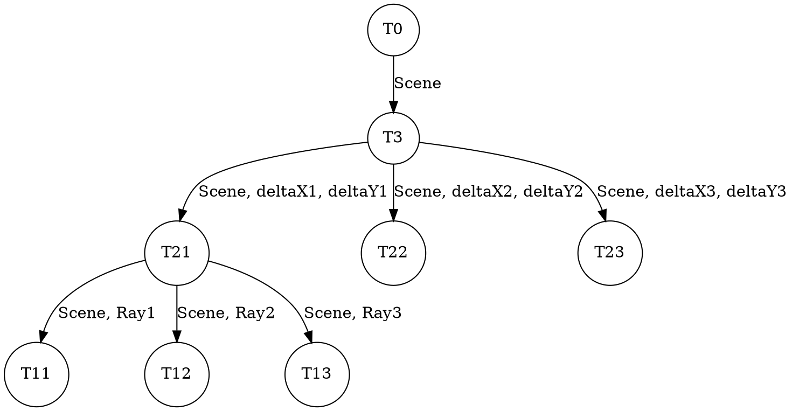
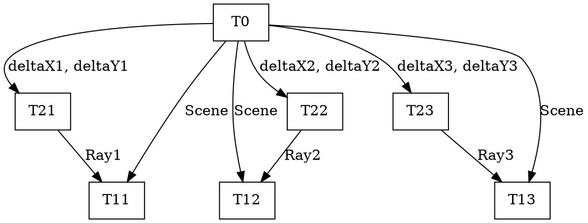

### Info
*Se usó para graficar Graphviz para Markdown, pero se adjuntó imagenes para el que no tenga la herramienta*

## Partición_Funcional
```
public void generateImage() {
    <T0>
    |    Ray ray; Colour color;                   
    |    double deltaX = 2d / width;
    |    double deltaY = 2d / height;
    </T0>
        <T3>
        | for(int j = 0; j < width; j++) {
        |     <T2>
        |     | for(int i = 0; i < height; i++) {
        |     |        Point p1 = new Point(-1 + i * deltaX, 1 - j * deltaY, -2d);
        |     |        Point p0 = new Point(0, 0, 0);
        |     |        ray = new Ray(p0, p1);
        |     |   <T1>
        |     |   |    color = Scene.intersectRay(ray); 
        |     |   </T1>
        |     |        image[i][j] = color;
        |     |  }
        |     </T2>
        | }
        </T3>
    }
```
### **< T1>**
```
public static Colour intersectRay(Ray ray) {
        double minT = Double.MAX_VALUE;
        Intersectable closest = null;
        // Chose the closest surface
        for(Intersectable intersectable: intersectables) {
            Solutions s = intersectable.intersect(ray);
            if(s.getNumSolutions() > 0) {
                // ignore solutions with a t value smaller than 0,
                // because they are behind the origin of the ray
                if(s.getT1() > 0.01) {
                    // Is this surface closer to the origin of the ray?
                    if(s.getT1() < minT) {
                        minT = s.getT1();
                        closest = intersectable;
                    }
                }
            }
        }
        if(closest != null) {
            Colour acum  = new Colour(0, 0, 0);
            double Ko = closest.getMaterial().Ko;
            double Kr = closest.getMaterial().Kr;
            double Kt = closest.getMaterial().Kt;
            // Compute this oject's color
            if(Ko != 0) {
                Colour thisColor = Colour.multiply(closest.callShader(ray, minT),Ko);
                acum = Colour.add(acum, thisColor);
            }
            // Compute the reflection
            if(Kr != 0) {
                // Find the normal at the solution
                Point p = ray.evaluate(minT);
                Vector4 normal = closest.computeNormal(p);
                // create the reflection ray (reflectedRay)
                Vector4 direction = Vector4.reflection(ray.getU(), normal);
                Ray reflectedRay = new Ray(p, direction);
                // send the ray to intersect with objects in the scene (Scene.intersectRay(reflectedRay))
                // (this is where recursion takes place)
                Colour reflectedColor = Scene.intersectRay(reflectedRay);
                // multiply the color by the corresponding Weight (Kr) 
                reflectedColor = Colour.multiply(reflectedColor, Kr);
                // and add the color to acum
                acum = Colour.add(acum, reflectedColor);
            }
            return acum;
        }
        return BACKGROUNDCOLOR;
    }
```

## Partición_Funcional


---
## Partición_Data



---
## Comunicación


---
## Aglomeración


---
## M(apeo)


